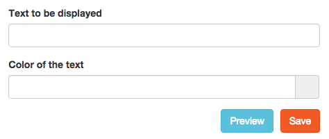
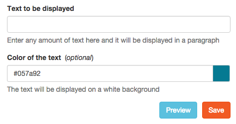
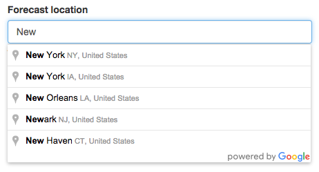
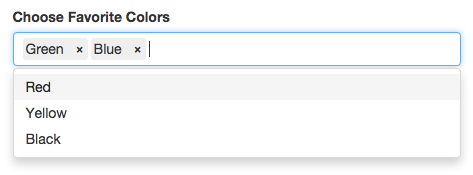

# Creating Your Own OnSign TV Widgets

First thing you must know is that OnSign TV widgets are nothing more than plain HTML5 pages. When the player is displaying a Widget it is actually showing a local webpage.

However, since static pages wouldn't suffice for most use cases, OnSign TV allows you to specify configuration options that should be filled in by the end-user while providing you a way to act on their given values. We call your custom widget an *HTML template*, because it needs to be filled in with user values in order to be converted to a regular HTML page, in a process we call *rendering*.

OnSign TV uses the Jinja templating language, which is flexible yet simple:

```html+jinja
<!DOCTYPE html>
<html lang="en">
  <head>
    <title>Custom Widget</title>
    <meta name="description" content="Long widget description">
  </head>
  <body>
    <ul id="feed">
    
      <li><a href="{{ item.link }}">{{ item.title }}</a></li>
    
    </ul>
    <p>Brought to you by:</p>
    <p>{{ a_variable }}</p>
  </body>
</html>
```

The templating language allows you to do thing like iterating over values, calling functions and do all sorts of computation. You can read more about it here: <http://jinja.pocoo.org/docs/dev/templates/>.

If you don't have end-user configurations, you don't need to use the templating language. You can just create a custom widget with regular HTML.

There are two tags that are relevant to the widget itself: the `<title>` and `<meta name="description">` tags. They allow you to change the widget title and description that will be presented to the end-user. Please mind that according to the HTML5 standard the **title tag is mandatory** and OnSign TV will enforce that rule.

## End-User Widget Configuration

All widgets are meant to be configurable by the end-user, who doesn't necessarily has knowledge about HTML5 or programming in general. To empower the user to configure the widget all you have to do is add some extra `<meta>` tags in your HTML template:.

```html+jinja
<!DOCTYPE html>
<title>Sample Widget</title>

<meta type="text" name="user_text" label="Text to be displayed">
<meta type="color" name="text_color" label="Color of the text">
<p style="color: {{ text_color }};">{{ user_text }}</p>
```

These `<meta>` tags will be recognized by OnSign TV and presented to the user as a regular web form. Like this one:



Once the user fills up this form, the values submitted by him will be available for use in your template. Configuration `<meta>` tags have three required attributes: `type`, `name` and `label`:


 Attribute | Action
-----------| -------------
  `type`   | Restrict the kind of values the user will be allowed to enter. Check the next session for more information about configuration types.
  `name`   | Name of the variable that will be available for you to use inside your template. The value of that variable will be given by the end-user. On the example above we are using a variable to show an end-user submitted text. **Variable names are restricted to only lowercase letters and underscores, without spaces or dashes**.
  `label`  | A label that will be shown to the end-user to aid the filling of the form.


There are three more attributes that you can use to further help the end user. All of them are not required.

```html+jinja
<!DOCTYPE html>
<title>Sample Widget With Better Instructions</title>

<meta type="text" name="user_text" label="Text to be displayed"
      help="Enter any amount of text here and it will be displayed in a paragraph">
<meta type="color" name="text_color" value="#8F3627" label="Color of the text"
      help="The text will be displayed on a white background" optional>

<p  style="color: {{ text_color }};" >
  {{ user_text }}
</p>
```

This sample widget configuration will be shown to the user as such:



Note that the more information you provide a user about your widget, the easier it will be to correctly configure it. Here are the extra attributes you can use:


  Attribute  | Action
-------------| -------------
  `help`     | Text containing further instructions on how to fill this value.
  `value`    | Determines the initial value before the end-user customizes the widget. Not all `types` of values support this attribute.
  `optional` | By default the user is required to fill in every single configuration option, except when the `optional` attribute is present. You must always test whether variables that are optional have a value, otherwise rendering of your widget will fail.


### Available Widget Configuration Types

When making an configuration option available to the end-user you must select one of the following types: `boolean`, `choice`, `color`, `image`, `number`, `text` and `webfeed`. Each type will be displayed and validated differently so choose thoughtfully.


#### Type `bool`

Allows the choice between true or false. It will be rendered as a checkbox when displayed to the end-user. It can have the initial value of `true` or `false` and will become a boolean variable for use on your template.

```html+jinja
<!DOCTYPE html>
<title>Sample Widget</title>

<meta type="bool" name="show_greeting" label="Display a welcome message" value="true">


  <p>Hello User!</p>

```

This meta tag will be shown to the user like this:


#### Type `choice`

The configuration type `choice` allows the end-user to choose between a set of options you have given. It presents a few differences from other types, as it requires multiple `<meta>` tags with the same `name` value in order to build a single `choice` configuration. The `value` attribute is **mandatory** for this type of configuration, as the variable will contain the `value` the end-user have chosen among all values made available by you. It will be rendered as a `<select>` for the end-user, with the first `<option>` selected.

```html+jinja
<!DOCTYPE html>
<title>Sample Widget</title>

<meta type="choice" name="background" value="transparent" label="Background Color: No background">
<meta type="choice" name="background" value="light" label="Background Color: Light">
<meta type="choice" name="background" value="dark" label="Background Color: Dark">

<style type="text/css" media="screen">
  p {
    
      background-color: rgba(0, 0, 0, 0);
    
      background-color: #000000;
    
      background-color: #FFFFFF;
    
  }
</style>

<p>Hello User!</p>
```

This meta tag will be shown to the user like this:


#### Type `color`

Allows the user to choose a color. It will be rendered as a color picker. Color values are always in HEX format e.g. `#000000` for black or `#FF0000` for pure red. It will become a string variable for you to use on your templates.

```html+jinja
<!DOCTYPE html>
<title>Sample Widget</title>

<meta type="color" name="background_color" label="Text background color" value="#FFFFFF">

<style type="text/css" media="screen">
  p {
    background-color: {{ background_color }};
  }
</style>

<p>Hello User!</p>
```

This meta tag will be shown to the user like this:


#### Type `float`

This type allows an user to enter a floating point number, between 0 and 9999. It will be rendered as a text input to the user, enforcing numeric values. It becomes an float variable for you to use on your templates, allowing you do to math operations on it.

```html+jinja
<!DOCTYPE html>
<title>Sample Widget</title>

<meta type="float" name="price" label="Product price" value="49.90">

<p id="product_10" class="price">{{ price }}</p>
```

This meta tag will be shown to the user like this:


#### Type `image`

This type allows you access to an end-user submitted image.

```html+jinja
<!DOCTYPE html>
<title>Widget with User-Submitted Files</title>

<meta type="image" name="background_image" label="Background Image">

<style type="text/css" media="screen">
  body {
    background-image: url({{ background_image.url }});
    background-size: {{ background_image.width + 20 }}px 100%;
  }
</style>

<p>
  
    This is a small background
  
    This is a large background
  
</p>
```

This meta tag will be shown to the user like this:


##### Attributes

Attribute | Description          
--------- | -----------
`url` | Fully qualified URL to the user's file.
`width` | Image's width in pixels.
`height` | Image's width in pixels.

#### Type `instagram`

This type grants you the possibility to access an end-user Instagram feed. The user authorizes his account at the Social Accounts settings. Then he can choose to show its own photos, feed or likes.
You will receive the user `feed_url` inside the variable with the same name that you input into the `name` property on the `<meta>` tag. Also there's the `feed_data` property which contains preloaded data for fast access while fetching for new data through the Internet.

```html+jinja
<!DOCTYPE html>
<title>Instagram Widget</title>

<meta type="instagram" name="account" label="Instagram account">


<script type="text/javascript">
  function showInstagram(post) {
    var element = document.querySelector('.instagram-photo');
    element.src = post.image.url;
  }

  // For fast rendering we get access to the data of the forecast when rendering the template.
  var PRELOADED_DATA = {{ account.feed_data }};
  showInstagram(PRELOADED_DATA);

  var request = new XMLHttpRequest();
  request.open('GET', '{{ account.feed_url }}', true);
  request.onload = function instagramResponse() {
    if (this.status >= 200 && this.status < 400) {
      var data = JSON.parse(this.response);
      showInstagram(data);
    } else {
      console.log('Error requesting Instagram data');
    }
  };
  request.send();
</script>
```

The payload received from requesting the feed URL uses the following structure:

```json
{
  "created_time": "2015-10-10T10:30:00Z",
  "posts": [
    {
      "caption": "Photo description/caption",
      "comment_count": 0,
      "created_time": "2015-01-01T11:00:00Z",
      "id": "123456789",
      "image": {
        "height": 640,
        "url": "https://photo.url/example.jpg",
        "width": 640
      },
      "like_count": 0,
      "tags": [
        "example", "tag"
      ],
      "type": "image",
      "user": {
        "full_name": "User Full Name",
        "id": "123456789",
        "profile_picture": "https://profile_pic.url/example.jpg",
        "username": "username"
      }
    }
  ]
}
```

This meta tag will be shown to the user like this:


#### Type `location`

The `location` type brings to you forecast data about user-entered locations. Two of the available attributes for use: `forecast_url` and `forecast_data`, the former is an URL used to get weather updates for the location and the latter a preloaded JSON of the forecast data for fast loading.

```html+jinja
<!DOCTYPE html>
<title>Location Widget</title>

<meta type="location" name="weather" label="Forecast location">

<div class="forecast">
  Temperature <span class="temp"></span>
</div>

<script type="text/javascript">
  function displayForecast(forecast) {
    var element = document.querySelector('.temp');
    var today = Date.now();

    element.innerHTML = forecast.daily[today].temperature;
  }

  // For fast rendering we get access to the data of the forecast when rendering the template.
  var PRELOADED_FORECAST = {{ weather.forecast_data|safe }};
  displayForecast(PRELOADED_FORECAST);

  var request = new XMLHttpRequest();
  request.open('GET', '{{ weather.forecast_url }}', true);
  request.onload = function() {
    if (request.status >= 200 && request.status < 400) {
      try {
        var forecast = JSON.parse(request.responseText);
        displayForecast(forecast);
      } catch (e) {
        console.error('Error requesting forecast', e);
      }
    }
  };
  request.send();
</script>
```

The `forecast` data comes with the following structure:

```json
{
  "daily": {
    "1447200000": {
      "icon": "partly-cloudy-day",
      "temperatureMax": 32,
      "temperatureMin": 25
    }
  },
  "hourly": {
    "1447171200": {
      "icon": "clear-day",
      "temperature": 30
    }
  },
  "offset": -3
}
```

There are `hourly` and `daily` updates. The numbers acting like keys from key-value pairs are the exact amount of milliseconds of that specific hour or day. The `offset` property corresponds to the difference in minutes between local and UTC time.

This meta tag will be shown to the user like this:



##### Attributes

Attribute | Description
--------- | -----------
`forecast_url` | URL to fetch forecast data.
`forecast_data` | Preloaded forecast data.
`latitude` | Location latitude.
`longitude` | Location longitude.
`city` | City name.
`timezone` | Location timezone.
`timezone_offset` | Difference from UTC in minutes.
`timezone_dst` | `true` or `false` for Daylight Saving Time.

#### Type `lottery_br`

#### Type `media`

The `media` type allows the user to choose a list of media files (audio and video) to be used by the widget. All media files have an `url` property that points to the file. Video files have `duration` and images have `width` and `height` properties.

```html+jinja
<!DOCTYPE html>
<title>Media Widget</title>

<meta type="media" name="images" label="Choose your images" help="Set of images to show on screen.">

<div class="images">

  

</div>
```

This meta tag will be shown to the user like this:


#### Type `multichoice`

Works similarly to the `choice` type as it needs multiple `<meta>` tags with the same `name` property to build one `multichoice` input. Also the `value` property is mandatory because the resultant variable will contain a list of chosen values. The difference is that the end-user will be allowed to choose multiple values, instead of just one.

```html+jinja
<!DOCTYPE html>
<title>Multichoice Widget</title>

<meta type="multichoice" name="colors" value="red" label="Choose Favorite Colors: Red">
<meta type="multichoice" name="colors" value="green" label="Choose Favorite Colors: Green">
<meta type="multichoice" name="colors" value="blue" label="Choose Favorite Colors: Blue">
<meta type="multichoice" name="colors" value="yellow" label="Choose Favorite Colors: Yellow">
<meta type="multichoice" name="colors" value="black" label="Choose Favorite Colors: Black">

<div class="colors">
  Favorite Colors:
  <ul>
  
    <li>{{ color }}</li>
  
  </ul>
</div>
```

This meta tag will be shown to the user like this:



Also the user has the possibility to order his choices inside the input. Be aware that the list of choices inside the widget will come accordingly to the end-user order.

#### Type `number`

This type allows an user to enter a number, between 0 and 9999. It will be rendered as a text input to the user, enforcing numeric values. It becomes an integer variable for you to use on your templates, allowing you do to math operations on it.

```html+jinja
<!DOCTYPE html>
<title>Sample Widget</title>

<meta type="number" name="delay" label="Greeting message delay" value="10">

<p id="greeting" style="display: none;">Hello User!</p>

<script type="text/javascript">
  window.setTimeout(function() {
    document.getElementById('greeting').style.display = 'block';
  }, {{ delay * 1000 }});
</script>
```

This meta tag will be shown to the user like this:


#### Type `paragraph`

It will be rendered to the user as a text area where it allows the input of multiple lines of text. Becomes a string variable where each line is separated by `\r\n`.

```html+jinja
<!DOCTYPE html>
<title>Sample Widget</title>

<meta type="paragraph" name="text" label="Text to show on screen" value="Type here" help="One message per line.">

<p>{{ text }}</p>
```

This meta tag will be shown to the user like this:


#### Type `richtext`

Grants the end-user possibility to write multiple lines of text and stylize as he wishes. The input will become a string variable that contains **HTML** formatted text.

```html+jinja
<!DOCTYPE html>
<title>Rich Text Widget</title>

<meta type="richtext" name="text" label="Write your text">

<div class="content">{{ text }}</div>
```

This meta tag will be shown to the user like this:


And the `html` below is the generated content if you style the text like the screenshot above:

```html
<div id="content">
  <h1 style="text-align: center;">Title</h1>
  <h2>Subtitle</h2>
  <p>
    Have fun styling your text with a <b>variety</b> of options.
  </p>
  <p>This is a WYSIWYG <i>editor</i>. Be <u>creative</u>!</p>
</div>
```

You can check that all `CSS` styles are inlined inside the elements (e.g. `h1` tag), hence there's no need to include your own styles. Also,  you can configure the text font sizes maintaining the proportion between elements, because all the font sizes are configured to use [`em`s relative units](https://developer.mozilla.org/en/docs/Web/CSS/font-size#Ems "em's Units").

#### Type `text`

Text allows the user to enter a single line of text. It will be rendered as a text input to the end-user. It becomes a string variable for use on your template.

```html+jinja
<!DOCTYPE html>
<title>Sample Widget</title>

<meta type="text" name="greeting" label="Welcome message" value="Welcome! Make yourself comfortable">

<p>{{ greeting }}</p>
```

This meta tag will be shown to the user like this:


#### Type `url`

The `url` type works similarly to the `text`. The only addition is that it validates the end-user input against a URL validator and shows an error in case it's not correct:


```html+jinja
<!DOCTYPE html>
<title>Sample Widget</title>

<meta type="url" name="portfolio" label="Enter the web address of your portfolio">

<p>{{ portfolio }}</p>
```

This meta tag will be shown to the user like this:


#### Type `webfeed`

The `webfeed` type allows the user to enter the URL of an RSS, Atom or Facebook feed and makes it available to be rendered as HTML. This type is the most complex one available to use when creating your widget, as it allows you to access each entry of the web feed in an uniform way, regardless of whether it is an RSS or Atom or Facebook feed.

```html+jinja
<!DOCTYPE html>
<title>Widget with Web Feed</title>

<meta type="webfeed" name="webfeed" label="RSS or Atom Feed URL" value="http://webfeed.rss">


  <div>
    <strong>{{ entry.title }}</strong>

    {# More info on formatting dates at http://strftime.org/ #}
    <em>{{ entry.publish_date.strftime("%m/%d/%Y") }}</em>

    
      <p>{{ entry.content }}</p>
    

    
      
    
  </div>

```

This meta tag will be shown to the user like this:


##### Attributes

`webfeed` meta tag brings to you a list of objects which contain information about a type of web data. Each object will be referred here as an **entry**.

###### Webfeed

Attribute | Description
--------- | -----------
`current` | List of the most recent fetched entries.

###### Entry

Attribute | Description
--------- | -----------
`title` | Entry title.
`content` | Longer description of the entry. *Optional*.
`publish_date` | Publishing date informed by the web feed.
`image` | Image related to the entry. *Optional*.
`image.url` | URL pointing to the image file.
`image.width` | Image's width.
`image.height` | Image's height.

##### Tips

1. Variables of the kind `webfeed` are lists: meaning you can access each entry in them by using `` and check their length by using `{{ webfeed|count }}`. The latest 20 entries that existed on the web feed will be avaliable this way.
2. You can access the `current` entries like this `` or even `{{ webfeed.current|count }}`. *Mind that some feeds only have a couple of entries at any single moment so it might be better to use cached entries than too few entries.*
3. Both lists that are subject to slicing. You can get only the first 5 entries as such ``. To know more about slices you can [check this answer on StackOverflow](http://stackoverflow.com/a/509295/21648) or [this Wikipedia entry on Slicing](http://en.wikipedia.org/wiki/Array_slicing#1991:_Python).
4. The `title` property is usually short but can be arbitrarily long. One can truncate the text by using the `truncate` filter to ensure a maximum length for the text: `{{ entry.title|truncate(20) }}`
5. The `publish_date` attribute is a Python `datetime` variable and needs to be formatted to a string before using. You can [read more about formatting *datetime* objects on this guide](http://strftime.org/).

## Available Utilities

To give you more flexibility when creating widgets we've created a set of functions and filters to extend the built-in [functions](http://jinja.pocoo.org/docs/dev/templates/#list-of-global-functions "Jinja Built-in Functions") and [filters](http://jinja.pocoo.org/docs/dev/templates/#list-of-builtin-filters) provided by the jinja template.

### Functions

Function | Description
-------- | -----------
`darken(color, amount=0.1)` | Decrease the lightness of a `color` by an absolute `amount`. The `amount` can be specified as a decimal number ranging from `0.0-1.0`  or a string value from `'0%'-'100%'`.
`lighten(color, amount=0.1)` | Increase the lightness of a `color` by an absolute `amount`. The `amount` can be specified as a decimal number ranging from `0.0-1.0`  or a string value from `'0%'-'100%'`.
`contrast(color, light, dark, threshold=0.43)` | Returns which of the two colors (`light` or `dark`) provides the greatest contrast with `color`. `threshold` is a percentage specifying the transition from "dark" to "light". The `threshold` can be specified as a decimal number ranging from `0.0-1.0`  or a string value from `'0%'-'100%'`.
`fetch_feed(rss_url)` | Fetches the feed from a `rss_url`. Returns an object with the same structure as the `webfeed` type. The main difference is that the `webfeed` URL is specified by the end-user and here by you.

#### Usage

```html+jinja
<!DOCTYPE html>
<title>Sample Widget</title>

<meta type="color" name="background_color" label="Text background color" value="#FFFFFF">

<style type="text/css" media="screen">
  p {
    background-color: {{ background_color }};
  }

  p:hover {
    background-color: {{ lighten(background_color, '50%') }};
  }
</style>

<p>Hello User!</p>
```

### Filters

Filter | Description
------ | -----------
`numberfmt(number, decimal_sep='.', thousand_sep=',', decimal_pos=2)` | Applies number formatting to the `number` variable.

#### Usage

```html+jinja
<!DOCTYPE html>
<title>Sample Widget</title>

<meta type="float" name="price" label="Product price" value="0.0">

<p class="product-price">{{ price|numberfmt(',','.') }}</p>
```

### User Data Validation

Validator | Description
--------- | -----------
`regex_match(pattern, string, case_insensitive=False)` | Returns `true` or `false`. Tries to match `string` with `pattern`.

#### Error block

The `error` block has been created to act like a `throw` clause existent on languages like `javascript` and `java`. When validating end-user data, in case there are invalid inputs you can use this block to prevent the user from saving and even previewing the widget.

It shows an error message like this one (customizable message):


#### Usage example of data validation with error throwing

```html+jinja
<!DOCTYPE html>
<title>Sample Widget</title>

<meta type="text" name="video_url" label="YouTube Video URL" help="This URL should look like this: https://www.youtube.com/watch?v=9d8wWcJLnFI">



  

```

## Using media files on your widget

Widgets aren't only comprised of HTML files: you also need images, CSS and Javascript files. Since widgets need to be shown even when there is no internet connection, you must upload all the assets needed to show your widget to the same folder containing the HTML template of your widget.

Once you upload them you must be able to reference them in your templates. All files you've uploaded are available for you under the `media` variable.

Say your HTML template *widget.html* needs two files - *jQuery-2.0.1.js*, *Background_Image.png* - to work correctly and you already uploaded all three files to the same folder. Now you'd like to reference that script and that image on your widget. Here is how you do it:

```html+jinja
<!DOCTYPE html>
<title>Example of referencing media</title>
<script type="text/javascript" src="{{ media.jquery_2_0_1.url }}"></script>
<style type="text/css" media="screen">
  body {
    background-image: url({{ media.background_image.url }});
    background-size: {{ media['Background_Image.png'].width + 20 }}px 100%;
  }
</style>
```

When using media please mind the following:

1. All files are accessed through the `media` variable. The name of the file is transformed from what you uploaded into a valid variable name. That means all text is lowercased, the extension is removed and all punctuation becomes underscores.
2. You can alternatively access files through their original name using the bracket syntax: `[]`. In our example both `media.background_image` and `media['Background_Image.png']` refer to the same file.
3. Files contain an `url` property, that will contain the *URL* to that file. This should the only way to reference a media inside your widget and no manipulation of this value is allowed. Please mind that failing to use this variable will cause your widget to be incorrectly rendered when sent to a user's player.
4. Image files will also contain two extra attributes: `width` and `height`, containing the respective width and height of the image, in pixels. You are allowed to do all sorts of mathematical manipulations with those values, useful when doing CSS adjustments.
