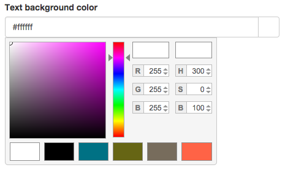
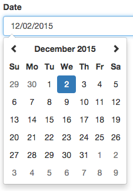
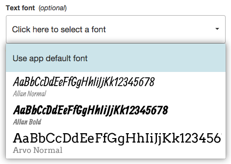
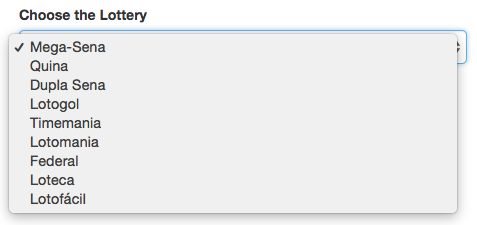
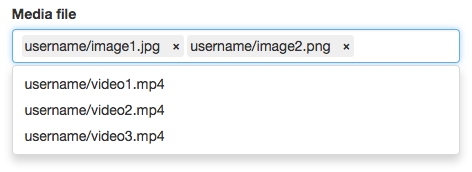
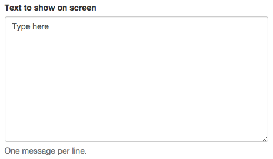
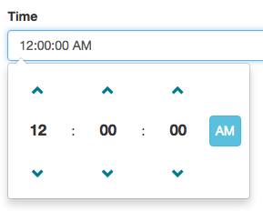

# App Configuration

Apps are are meant to be configurable by the end-user, who doesn't necessarily have knowledge about HTML5 or programming in general. To empower the user to change the app to fit their needs some extra `<meta>` tags should be added your *HTML5 App Template*:

We call that action *configuring the app*. Before configuring, the app is an *HTML5 template*, because it needs to be filled in with user values in order to be converted to a regular HTML5 page.

```html+jinja
<!DOCTYPE html>
<title>Sample App</title>

<meta type="text" name="user_text" label="Text to be displayed">
<meta type="color" name="text_color" label="Color of the text">
<p style="color: {{ text_color }};">{{ user_text }}</p>
```

These `<meta>` tags will be recognized by OnSign TV and presented to the user as a regular web form. Like this one:


Once the end-user fills up this form, the submitted values will be available for use in the HTML5 template, as template variables under the given `name`s. Configuration `<meta>` tags have three required attributes: `type`, `name` and `label`:


 Attribute | Action
---------- | -------------
  `type`   | Restrict the kind of values the user will be allowed to enter. Check the next session for more information about configuration types.
  `name`   | Name of the template variable that will be available for you to use inside your template. The value of that variable will be given by the end-user. On the example above we are using a variable named `text_color` to show an end-user submitted text. **Variable names are restricted to only lowercase letters and underscores, without spaces or dashes**.
  `label`  | A label that will be shown to the end-user to aid the filling of the form.


There are three more optional attributes that you can use to help the end user configure the app.


```html+jinja
<!DOCTYPE html>
<title>Sample App With Better Instructions</title>

<meta type="text" name="user_text" label="Text to be displayed"
      help="Enter any amount of text here and it will be displayed in a paragraph">
<meta type="color" name="text_color" value="#8F3627" label="Color of the text"
      help="The text will be displayed on a white background" optional>

<p  style="color: {{ text_color }};" >
  {{ user_text }}
</p>
```

This sample app configuration will be shown to the user as such:


Note that the more information you provide the end-user about your app configuration, the easier it will be to correctly configure it. Here are the extra attributes you can use:


  Attribute  | Action
------------ | -------------
  `help`     | Text containing further instructions on how to fill this value.
  `value`    | Determines the initial value before the end-user customizes the app. Not all `types` of values support this attribute.
  `optional` | By default the end-user is required to fill in every single configuration option, except when the `optional` attribute is present. You must always test whether variables that are optional have a value, otherwise configuration of your app will fail.


## Available App Configuration Types

When making an configuration option available to the end-user the developer must select one of the following types:

- [`bool`](#type-bool)
- [`choice`](#type-choice)
- [`color`](#type-color)
- [`date`](#type-date)
- [`datetime`](#type-datetime)
- [`float`](#type-float)
- [`font`](#type-float)
- [`image`](#type-image)
- [`instagram`](#type-instagram)
- [`location`](#type-location)
- [`lottery_br`](#type-lottery_br)
- [`media`](#type-media)
- [`multichoice`](#type-multichoice)
- [`number`](#type-number)
- [`paragraph`](#type-paragraph)
- [`richtext`](#type-richtext)
- [`text`](#type-text)
- [`time`](#type-time)
- [`url`](#type-url)
- [`webfeed`](#type-webfeed)

Each type will be displayed and validated differently so choose thoughtfully.


### Type `bool`

Allows the choice between true or false. It will be shown as a checkbox to the end-user. It can have the initial value of `true` or `false` and will become a boolean variable for use on your template.

```html+jinja
<!DOCTYPE html>
<title>Sample App</title>

<meta type="bool" name="show_greeting" label="Display a welcome message" value="true">


  <p>Hello User!</p>

```

This meta tag will be shown to the user like this:


### Type `choice`

The configuration type `choice` allows the end-user to choose between a set of options you have given. It presents a few differences from other types, as it requires multiple `<meta>` tags with the same `name` value in order to build a single `choice` configuration. The `value` attribute is **mandatory** for this type of configuration, as the template variable will contain the `value` the end-user have chosen among all values made available by you. It will be rendered as a `<select>` for the end-user, with the first `<option>` selected.

```html+jinja
<!DOCTYPE html>
<title>Sample App</title>

<meta type="choice" name="background" value="transparent" label="Background Color: No background">
<meta type="choice" name="background" value="light" label="Background Color: Light">
<meta type="choice" name="background" value="dark" label="Background Color: Dark">

<style type="text/css" media="screen">
  p {
    
      background-color: rgba(0, 0, 0, 0);
    
      background-color: #000000;
    
      background-color: #FFFFFF;
    
  }
</style>

<p>Hello User!</p>
```

This meta tag will be shown to the user like this:


### Type `color`

Allows the user to choose a color. It will be rendered as a color picker. Color values are always in HEX format e.g. `#000000` for black or `#FF0000` for pure red. It will become a string template variable. You can tweak this value with one of the available [color manipulation functions](#additional-functions).

```html+jinja
<!DOCTYPE html>
<title>Sample App</title>

<meta type="color" name="background_color" label="Text background color" value="#FFFFFF">

<style type="text/css" media="screen">
  p {
    background-color: {{ background_color }};
  }
</style>

<p>Hello User!</p>
```

This meta tag will be shown to the user like this:




### Type `date`

Allows the user to enter a date. It will be rendered as a date picker. The date picker presentation will depend on the user [Locale][wiki-locale] setting. Date values are always validated to prevent the user from entering an invalid date. When rendered in the app, the date will be presented using the [ISO 8601](wiki-iso8601) format (e.g., 2015-12-31).

[wiki-iso8601]: https://en.wikipedia.org/wiki/ISO_8601
[wiki-locale]: https://en.wikipedia.org/wiki/Locale

```html+jinja
<!DOCTYPE html>
<title>Sample App</title>

<meta type="date" name="date_value" label="Date">

<p>The entered date is {{date_value}}</p>
```

This meta tag will be shown to the user like this:




### Type `datetime`

Allows the user to enter a date and time. It will be rendered as a date-time picker. The date-time picker presentation will depend on the user [Locale][wiki-locale] setting. Date and time are always validated to prevent the user from entering invalid values. When rendered in the app, the date will be presented using the [ISO 8601](wiki-iso8601) format (e.g., 2015-12-31) and the time will be displayed as `HH:MM:SS-Z` (e.g., 17:30:50-02:00).

[wiki-locale]: https://en.wikipedia.org/wiki/Locale

```html+jinja
<!DOCTYPE html>
<title>Sample App</title>

<meta type="datetime" name="datetime_value" label="Date-Time">

<p>The entered date and time are {{datetime_value}}</p>
```

This meta tag will be shown to the user like this:


### Type `float`

This type allows an user to enter a floating point number, between 0 and 9999. It will be rendered as a text input to the user, enforcing numeric values. It becomes an float template variable, allowing you do to math operations on it.

```html+jinja
<!DOCTYPE html>
<title>Sample App</title>

<meta type="float" name="price" label="Product price" value="49.90">

<p id="product_10" class="price">{{ price }}</p>
```

This meta tag will be shown to the user like this:


### Type `font`

This type allows the user to select between multiple choices of font. Western and Eastern types.

#### Font Attributes

Attribute | Description
--------- | -----------
`style`   | This property has to be used before you define your own CSS styles. It returns a `@font-face` properly importing the chosen typeface. Remember that it's already wrapped in a `style` tag.
`family`  | The name of the font family. To be used in the CSS `font-family` or `font` property.

```html+jinja
<!DOCTYPE html>
<title>Sample App</title>

<meta type="font" name="font_family" label="Text font" help="Change the font used to show the text." optional>


  {{ font_family.style }}


<style>
p.stylized {

  font-family: {{ font_family.family }};

}
</style>

<p class="stylized">Lorem ipsum dolor sit amet, consectetur adipisicing elit, sed do eiusmod tempor incididunt ut labore et dolore magna aliqua.</p>
```

Below you can check what both font properties return to the HTML page. Let's say you chose to import `Inconsolata`:

```html
<style>
  @font-face {
    font-family: 'Inconsolata Normal';
    src: url('file:///Inconsolata-Regular.ttf') format('truetype');
  }
</style>

<style>
  p.stylized {
    font-family: 'Inconsolata Normal';
  }
</style>
```

This meta tag will be shown to the user like this:


Notice that the option `Use app default font` only appears as a choice when the meta tag is marked as optional.




### Type `image`

This type allows access to an end-user submitted image, contained on their file storage. The user can select any image, so it's up to the developer to correctly adjust how that image will be displayed. It will become an [Image](#image-attributes) template variable with the following attributes:

#### Image Attributes

Attribute | Description
--------- | -----------
`url`     | Fully qualified URL to the user's file. This is the only way to access the image content.
`width`   | Width of the image, in pixels.
`height`  | Height if the image, in pixels.


```html+jinja
<!DOCTYPE html>
<title>App with User-Submitted Image</title>

<meta type="image" name="background_image" label="Background Image">

<style type="text/css" media="screen">
  body {
    background-image: url({{ background_image.url }});
    background-size: {{ background_image.width + 20 }}px 100%;
  }
</style>

<p>
  
    This is a small background
  
    This is a large background
  
</p>
```

This meta tag will be shown to the user like this:


### Type `instagram`

This type grants you the possibility to access an end-user Instagram feed. The end-user needs to authorize the use of that Instagram account at the Social Accounts settings page before this type can be used.  The end-user can also choose to show the account's own photos, the account likes or the friend feed.

You will receive a way to access the chosen feed in the `feed_url` attribute of the chosen variable. In case you want to quickly show the feed you can use the `feed_data` attribute, which contains preloaded data from the `feed_url`, updated daily.

```html+jinja
<!DOCTYPE html>
<title>Instagram App</title>

<meta type="instagram" name="account" label="Instagram account">


<script type="text/javascript">
  function showInstagram(posts) {
    var element = document.querySelector('.instagram-photo');
    element.src = posts[0].image.url;
  }

  // For fast rendering we get access to the data of the forecast when rendering the template.
  var PRELOADED_DATA = {{ account.feed_data }};
  showInstagram(PRELOADED_DATA);

  var request = new XMLHttpRequest();
  request.open('GET', '{{ account.feed_url }}', true);
  request.onload = function instagramResponse() {
    if (this.status >= 200 && this.status < 400) {
      var data = JSON.parse(this.response);
      showInstagram(data);
    } else {
      console.log('Error requesting Instagram feed');
    }
  };
  request.send();
</script>
```

The payload received from requesting the feed URL has the following structure:

```json
{
  "created_time": "2015-10-10T10:30:00Z",
  "posts": [
    {
      "caption": "Photo description/caption",
      "comment_count": 0,
      "created_time": "2015-01-01T11:00:00Z",
      "id": "123456789",
      "image": {
        "height": 640,
        "url": "https://photo.url/example.jpg",
        "width": 640
      },
      "like_count": 0,
      "tags": [
        "example", "tag"
      ],
      "type": "image",
      "user": {
        "full_name": "User Full Name",
        "id": "123456789",
        "profile_picture": "https://profile_pic.url/example.jpg",
        "username": "username"
      }
    }
  ]
}
```

This type will be shown to the end-user like this:


### Type `location`

The `location` type brings to you information about a location chosen by the end-user. One of the data available about that location is the weather forecast. All attributes available `location` template variables are listed bellow:

#### Location Attributes

Attribute         | Description
----------------- | -----------
`forecast_url`    | URL to `GET` up-to-date weather forecast data.
`forecast_data`   | Preloaded weather forecast data, updated every six hours.
`latitude`        | Float value containing the latitude of that location.
`longitude`       | Float value containing the longitude of that location.
`city`            | Location city name, in the locale of the end-user.
`timezone`        | Location timezone ISO name, e.g. `'America/New_York'`.
`timezone_offset` | Current time difference from UTC of that location, in minutes. E.g. `-300` for `'America/New_York'`.
`timezone_dst`    | Boolean value containing whether the location is currently under Daylight Savings Time.


```html+jinja
<!DOCTYPE html>
<title>Location App</title>

<meta type="location" name="weather" label="Forecast location">

<div class="forecast">
  Temperature <span class="temp"></span>
</div>

<script type="text/javascript">
  function displayForecast(forecast) {
    var element = document.querySelector('.temp');
    var today = Date.now();

    element.innerHTML = forecast.daily[today].temperature;
  }

  // For fast rendering we get access to the data of the forecast when rendering the template.
  var PRELOADED_FORECAST = {{ weather.forecast_data }};
  displayForecast(PRELOADED_FORECAST);

  var request = new XMLHttpRequest();
  request.open('GET', '{{ weather.forecast_url }}', true);
  request.onload = function() {
    if (request.status >= 200 && request.status < 400) {
      try {
        var forecast = JSON.parse(request.responseText);
        displayForecast(forecast);
      } catch (e) {
        console.error('Error requesting forecast', e);
      }
    }
  };
  request.send();
</script>
```

The `forecast` data has the following structure:

```json
{
  "daily": {
    "1447200000": {
      "icon": "partly-cloudy-day",
      "temperatureMax": 32,
      "temperatureMin": 25
    },
    [...]
  },
  "hourly": {
    "1447171200": {
      "icon": "clear-day",
      "temperature": 30
    },
    [...]
  },
  "offset": -3
}
```

Forecast data is divided in `"hourly"` and  `"daily"` sections. There are 48 `"hourly"` forecast points and 7 `"daily"` ones, starting from the moment the data was requested. The keys in the `"hourly"` forecast are the UTC timestamp of the start of each hour, while on the `"daily"` are the UTC timestamps for the start of each day. The `offset` property corresponds to the difference, in hours, between local time and UTC on that location. Forecast data is provided by [Forecast IO](https://developer.forecast.io/docs/v2).

This meta tag will be shown to the user like this:


### Type `lottery_br`

This type corresponds to Brazilian lotteries. The end-user has the possibility to choose one which lottery to be shown and info about the last draw of the lottery will be available to you inside the app.

#### Lottery Attributes

Attribute          | Description
------------------ | -----------
`name`             | Name of the lottery.
`draw_number`      | Number of the last draw of this lottery.
`draw_date`        | Date when the last draw of this lottery happened.
`draw_results`     | The winning number of this draw.
`next_draw_date`   | Next date when a draw will happen.
`next_draw_amount` | Estimated prize amount for the next draw.

```html+jinja
<!DOCTYPE html>
<title>Lottery App</title>

<meta type="lottery_br" name="draw" label="Choose the Lottery">

<div class="lottery">
  <h1>{{ draw.name }}</h1>
  <div class="number">{{ draw.draw_number }}</div>
  <div class="date">{{ draw.draw_date }}</div>

  <h2>Results</h2>
  <ul>
  
    <li>{{ number }}</li>
  
  </ul>
</div>
```

This meta tag will be shown to the user like this:



### Type `media`

The `media` type allows the user to choose a list of media files (image and video) to be used by the app. The template variable will contain a list of media items. All media items have an `url` attribute that points to the end-user selected file. Items also have `width` and `height` attributes containing the value in pixels, like the [Image template variable](#image-attributes). Video items have an extra `duration` attribute containing the video duration in seconds.

```html+jinja
<!DOCTYPE html>
<title>Media App</title>

<meta type="media" name="images" label="Choose your images" help="Set of images to show on screen.">

<div class="images">

  

</div>
```

This meta tag will be shown to the user like this:



### Type `multichoice`

Works similarly to the `choice` type as it needs multiple `<meta>` tags with the same `name` property to build one `multichoice` configuration. The difference is that the end-user can choose multiple values, instead of just one. The variable will contain a list of values, which can be empty. Please mind that the end-user has the possibility to re-order the chosen values, so list of values can be different to the order defined in the template.


```html+jinja
<!DOCTYPE html>
<title>Multichoice App</title>

<meta type="multichoice" name="colors" value="red" label="Choose Favorite Colors: Red">
<meta type="multichoice" name="colors" value="green" label="Choose Favorite Colors: Green">
<meta type="multichoice" name="colors" value="blue" label="Choose Favorite Colors: Blue">
<meta type="multichoice" name="colors" value="yellow" label="Choose Favorite Colors: Yellow">
<meta type="multichoice" name="colors" value="black" label="Choose Favorite Colors: Black">

<div class="colors">
  Favorite Colors:
  <ul>
  
    <li>{{ color }}</li>
  
  </ul>
</div>
```

This meta tag will be shown to the end-user like this:


### Type `number`

This type allows an user to enter a number, between 0 and 9999. It will be rendered as a text input to the user, enforcing numeric values. It becomes an integer variable for you to use on your templates, allowing you do to math operations on it.

```html+jinja
<!DOCTYPE html>
<title>Sample App</title>

<meta type="number" name="delay" label="Greeting message delay" value="10">

<p id="greeting" style="display: none;">Hello User!</p>

<script type="text/javascript">
  window.setTimeout(function() {
    document.getElementById('greeting').style.display = 'block';
  }, {{ delay * 1000 }});
</script>
```

This meta tag will be shown to the user like this:


### Type `paragraph`

It will be rendered to the user as a text area where it allows the input of multiple lines of text. Becomes a string variable where each line is separated by `\r\n`.

```html+jinja
<!DOCTYPE html>
<title>Sample App</title>

<meta type="paragraph" name="text" label="Text to show on screen" value="Type here" help="One message per line.">

<p>{{ text }}</p>
```

This meta tag will be shown to the user like this:



### Type `richtext`

Grants the end-user possibility to write multiple lines of text and stylize as he wishes. The input will become a string variable that contains **HTML5** formatted text.

```html+jinja
<!DOCTYPE html>
<title>Rich Text App</title>

<meta type="richtext" name="text" label="Write your text">

<div class="content">{{ text }}</div>
```

This meta tag will be shown to the user like this:


And the `html` below is the generated content if you style the text like the screenshot above:

```html
<div id="content">
  <h1 style="text-align: center;">Title</h1>
  <h2>Subtitle</h2>
  <p>
    Have fun styling your text with a <b>variety</b> of options.
  </p>
  <p>This is a WYSIWYG <i>editor</i>. Be <u>creative</u>!</p>
</div>
```

You can check that all `CSS` styles are inlined inside the elements (e.g. `h1` tag), hence there's no need to include your own styles. Also, you can configure the text font sizes maintaining the proportion between elements, because all the font sizes are configured to use [`em` relative units](https://developer.mozilla.org/en/docs/Web/CSS/font-size#Ems "em's Units").


### Type `text`

Text allows the user to enter a single line of text. It will be rendered as a text input to the end-user. It becomes a string variable for use on your template.

```html+jinja
<!DOCTYPE html>
<title>Sample App</title>

<meta type="text" name="greeting" label="Welcome message" value="Welcome! Make yourself comfortable">

<p>{{ greeting }}</p>
```

This meta tag will be shown to the user like this:


### Type `time`

Allows the user to enter a time. It will be rendered as a time picker. The time picker presentation will depend on the user [Locale][wiki-locale] setting. Time is always validated to prevent the user from entering an invalid value. When rendered in the app, the time will be displayed as `HH:MM:SS` (e.g., 17:30:50).

[wiki-locale]: https://en.wikipedia.org/wiki/Locale

```html+jinja
<!DOCTYPE html>
<title>Sample App</title>

<meta type="time" name="time_value" label="Time">

<p>The entered time is {{time_value}}</p>
```

This meta tag will be shown to the user like this:




### Type `url`

The `url` type works similarly to the `text`. The only addition is that it validates the end-user input against a URL validator and shows an error in case it's not correct:


```html+jinja
<!DOCTYPE html>
<title>Sample App</title>

<meta type="url" name="portfolio" label="Enter the web address of your portfolio">

<p>{{ portfolio }}</p>
```

This meta tag will be shown to the user like this:


### Type `webfeed`

The `webfeed` type allows the user to enter the URL of an RSS, Atom or Facebook feed and makes it available to be rendered as HTML5. This type is the most complex one available to use when creating your app, as it allows you to access each entry of the web feed in an uniform way, regardless of whether it is an RSS or Atom or Facebook feed.

#### Attributes

The `webfeed` variable brings to you a list of items which contain information about web RSS, Atom or Facebook feed. The list contains both items currently present on the feed as well as older entries. Each item will be referred here as an **entry**.

##### Webfeed Attributes

Attribute      | Description
-------------  | -----------
`current`      | List of the entries currently present on the feed.
`url`          | The URL containing this feed.
`title`        | The title of the feed or the Facebook Page name.
`subtitle`     | The subtitle of the feed or the Facebook Page description.
`image`        | [Image](#image-attributes) related to the feed or the Facebook Page picture. *Optional*.

##### Entry Attributes

Attribute      | Description
-------------- | -----------
`title`        | Entry title.
`content`      | Longer description of the entry. *Optional*.
`publish_date` | Publishing date informed by the web feed.
`image`        | [Image](#image-attributes) related to the entry. *Optional*.
`extra`        | Raw information about the entry. For more details go to [Validate RSS](https://app.onsign.tv/feed/validate/)

```html+jinja
<!DOCTYPE html>
<title>App with Web Feed</title>

<meta type="webfeed" name="webfeed" label="RSS or Atom Feed URL" value="http://webfeed.rss">


  <div>
    <strong>{{ entry.title }}</strong>

    {# More info on formatting dates at http://strftime.org/ #}
    <em>{{ entry.publish_date.strftime("%m/%d/%Y") }}</em>

    
      <p>{{ entry.content }}</p>
    

    
      
    

    
      <p>{{ entry.extra.summary }}</p>
    
  </div>

```

This meta tag will be shown to the user like this:


#### Tips on using `webfeed`

1. Variables of the kind `webfeed` are lists: meaning you can access each entry in them by using `` and check their length by using `{{ webfeed|count }}`. The latest 20 entries that existed on the web feed will be avaliable this way.
2. You can access the `current` entries like this `` or even `{{ webfeed.current|count }}`. *Mind that some feeds only have a couple of entries at any single moment so it might be better to use cached entries than too few entries.*
3. Both lists that are subject to slicing. You can get only the first 5 entries as such ``. To know more about slices you can [check this answer on StackOverflow](http://stackoverflow.com/a/509295/21648) or [this Wikipedia entry on Slicing](http://en.wikipedia.org/wiki/Array_slicing#1991:_Python).
4. The `title` property is usually short but can be arbitrarily long. One can truncate the text by using the `truncate` filter to ensure a maximum length for the text: `{{ entry.title|truncate(20) }}`
5. The `publish_date` attribute is a Python `datetime` variable and needs to be formatted to a string before using. You can [read more about formatting *datetime* objects on this guide](http://strftime.org/).

## Available Utilities

To give you more flexibility when creating apps we've created a set of functions and filters to extend the built-in [functions](http://jinja.pocoo.org/docs/dev/templates/#list-of-global-functions "Jinja Built-in Functions") and [filters](http://jinja.pocoo.org/docs/dev/templates/#list-of-builtin-filters "Jinja Built-in Filters") provided by the Jinja templating language.

### Additional Functions

Function | Description
-------- | -----------
`darken(color, amount=0.1)` | Decrease the lightness of a `color` by an absolute `amount`. The `amount` can be specified as a decimal number ranging from `0.0 - 1.0` or a string value from `'0%'-'100%'`.
`lighten(color, amount=0.1)` | Increase the lightness of a `color` by an absolute `amount`. The `amount` can be specified as a decimal number ranging from `0.0 - 1.0` or a string value from `'0%'-'100%'`.
`contrast(color, light, dark, threshold=0.43)` | Returns which of the two colors (`light` or `dark`) provides the greatest contrast with `color`. `threshold` is a percentage specifying the transition from "dark" to "light". The `threshold` can be specified as a decimal number ranging from `0.0-1.0`  or a string value from `'0%'-'100%'`.
`fetch_feed(rss_url)` | Fetches the feed from a `rss_url`. Returns a variable with the same structure as the `webfeed` type. The main difference is that the `webfeed` URL is specified by the end-user and here by the developer.
`regex_match(pattern, string, case_insensitive=False)` | Tries to match `string` against `pattern` using the [Python Regular Expression Syntax](https://docs.python.org/2/library/re.html#regular-expression-syntax). Returns the list of captures of the regular expression or `None` if no match happened.


```html+jinja
<!DOCTYPE html>
<title>Sample App</title>

<meta type="color" name="background_color" label="Text background color" value="#FFFFFF">

<style type="text/css" media="screen">
  p {
    background-color: {{ background_color }};
  }

  p:hover {
    background-color: {{ darken(background_color, '50%') }};
  }
</style>

<p>Hello User!</p>
```

### Additional Filters

Filter | Description
------ | -----------
`numberfmt(number, decimal_sep='.', thousand_sep=',', decimal_pos=2)` | Applies number formatting to the `number` variable.


```html+jinja
<!DOCTYPE html>
<title>Sample App</title>

<meta type="float" name="price" label="Product price" value="0.0">

<p class="product-price">{{ price|numberfmt(',','.') }}</p>
```

## User Data Validation

Sometimes there is the need to perform extra validation on the variables, for instance when two different options cannot possibly be chosen together. For this we have the `error` block.

The `error` block has been created to act like a `throw` clause existent on languages like `javascript` and `java`. When validating end-user data, the developer can use this block to prevent the user from saving and even previewing the app, in case where the input is invalid.

It shows an error message like this one (customizable message):


#### Usage example of data validation with error throwing

```html+jinja
<!DOCTYPE html>
<title>Sample App</title>

<meta type="text" name="video_url" label="YouTube Video URL" help="This URL should look like this: https://www.youtube.com/watch?v=9d8wWcJLnFI">



  

```
